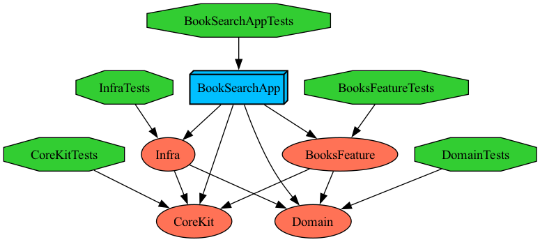

# BookSearch

도서 검색 및 상세 조회 iOS 애플리케이션 (itbook.store API 기반)

---

## 기술 스펙

- **언어**: Swift
- **UI**: UIKit
- **비동기**: Swift Concurrency (async/await)
- **바인딩**: Combine
- **아키텍처**: Clean + Modular
- **패턴**
  - MVVM (단방향 상태 바인딩)
  - Coordinator (화면 전환 책임 분리)
  - Dependency Injection (직접 구현한 DIContainer)
- **빌드 시스템**: [Tuist](https://tuist.io)
- **테스트**: XCTest (Cursory Test 스타일)

---

## 프로젝트 구성

- **Domain**
  - Entities (BookItem, BookDetail, SearchResult, PageInfo, …)
  - UseCases (SearchBooksUseCase, FetchBookDetailUseCase)
- **Feature**
  - Books
    - Search (검색 화면: 라우트 / ViewModel / View / UI)
    - Detail (상세 화면: 라우트 / ViewModel / View / UI)
    - DesignSystem (공용 UI, 이미지 로딩)
- **App**
  - Coordinator (SearchCoordinator, DetailCoordinator, Navigator)
  - Dependency (AppDependency, DIContainer)
  - Application (SceneDelegate 등)

---

## 의존성 방향

- `App` → `Feature/Books` → `Domain`
- `Feature`는 `Domain`에만 의존
- `App`은 `Feature`, `Domain`을 조립
- **역방향 의존 없음** (Domain은 Feature/App을 모름)

---

## 의존성 그래프


---

## 설계 패턴

- **MVVM**  
  View ↔ ViewModel 단방향 상태 바인딩(Combine), ViewModel은 UseCase 주입받아 비즈니스 처리
- **Coordinator**  
  화면 전환·흐름 제어 분리 (Search → Detail, Detail → Web)
- **Dependency Injection**  
  Swinject 미사용, 직접 구현한 `DIContainer` + `AppDependency`로 조립

---

## 주요 기능

- **검색**
  - 검색바 리턴키로 검색 실행
  - 테이블뷰에 결과 표시 (썸네일 + 제목/부제/가격/ISBN/URL)
  - 검색 결과 0건이면 `EmptyView`를 table background로 노출
- **페이지네이션 / 갱신**
  - 스크롤 말단 도달 시 다음 페이지 로드 (중복 요청 방지)
  - 당겨서 새로고침 (Pull-to-Refresh)
- **상세 화면**
  - BookDetail 전 필드 표시 (저자/출판사/언어/출판년도/페이지/평점/ISBN/링크/설명/표지)
  - PDF 목록 탭 시 Safari로 열기
- **이미지 로딩**
  - `RemoteImageDataLoader` 기반 비동기 로딩
  - 메모리/디스크 캐시 + 동일 URL 동시 요청 머지

---

## 🧭 실행 방법

```bash
tuist generate
open BookSearch.xcworkspace
